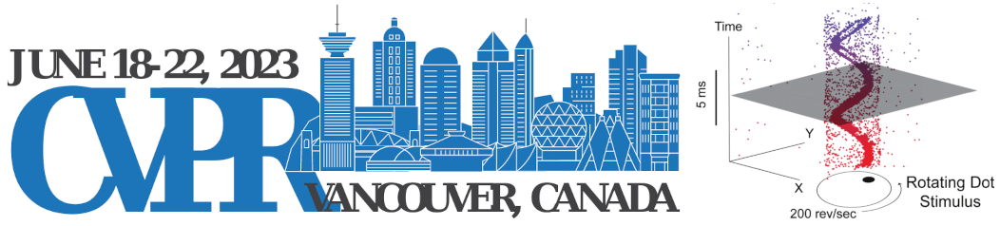

**June 19, 2023, Monday. 2nd day of CVPR**, Vancouver, Canada.
Starts at **10 am [Eastern Time](https://time.is/ET)**;  4 pm [Europe Time](https://time.is/CET).  
Held in conjunction with the [IEEE Conference on Computer Vision and Pattern Recognition](http://cvpr2023.thecvf.com/) 2023, as part of the track: CV for non-traditional modalities.

<b>Welcome to the 4th International Workshop on Event-Based Vision!</b>  

## Important Dates

- <b>Paper submission deadline: **March 20, 2023**.  **[Submission website (CMT)](https://cmt3.research.microsoft.com/EVENTVISION2023)**</b>
- Demo abstract submission: March 20, 2023
- Notification to authors: April 3, 2023
- Camera-ready paper: April 8, 2023 (firm deadline by IEEE)
- <b>Workshop day: **June 19, 2023. 2nd day of CVPR**. Full day workshop.</b>

## Objectives

This workshop is dedicated to event-based cameras, smart cameras, and algorithms processing data from these sensors. Event-based cameras are bio-inspired sensors with the key advantages of microsecond temporal resolution, low latency, very high dynamic range, and low power consumption. Because of these advantages, event-based cameras open frontiers that are unthinkable with standard frame-based cameras (which have been the main sensing technology for the past 60 years). These revolutionary sensors enable the design of a new class of algorithms to track a baseball in the moonlight, build a flying robot with the agility of a bee, and perform structure from motion in challenging lighting conditions and at remarkable speeds. These sensors became commercially available in 2008 and are slowly being adopted in computer vision and robotics. In recent years they have received attention from large companies, e.g., the event-sensor company Prophesee collaborated with Intel and Bosch on a high spatial resolution sensor, Samsung announced mass production of a sensor to be used on hand-held devices, and they have been used in various applications on neuromorphic chips such as IBM’s TrueNorth and Intel’s Loihi. The workshop also considers novel vision sensors, such as pixel processor arrays (PPAs), which perform massively parallel processing near the image plane. Because early vision computations are carried out on-sensor, the resulting systems have high speed and low-power consumption, enabling new embedded vision applications in areas such as robotics, AR/VR, automotive, gaming, surveillance, etc. This workshop will cover the sensing hardware, as well as the processing and learning methods needed to take advantage of the above-mentioned novel cameras.

## Topics Covered

- Event-based / neuromorphic vision.
- Algorithms: motion estimation, visual odometry, SLAM, 3D reconstruction, image intensity reconstruction, optical flow estimation, recognition, feature/object detection, visual tracking, calibration, sensor fusion (video synthesis, visual-inertial odometry, etc.).
- Model-based, embedded, or learning-based approaches.
- Event-based signal processing, representation, control, bandwidth control.
- Event-based active vision, event-based sensorimotor integration.
- Event camera datasets and/or simulators.
- Applications in: robotics (navigation, manipulation, drones...), automotive, IoT, AR/VR, space science, inspection, surveillance, crowd counting, physics, biology.
- Biologically-inspired vision and smart cameras.
- Near-focal plane processing, such as pixel processor arrays (PPAs).
- Novel hardware (cameras, neuromorphic processors, etc.) and/or software platforms, such as fully event-based systems (end-to-end).
- New trends and challenges in event-based and/or biologically-inspired vision (SNNs, etc.).
- Event-based vision for computational photography.
- A longer list of related topics is available in the table of content of the [List of Event-based Vision Resources](https://github.com/uzh-rpg/event-based_vision_resources) 

## Call for Papers

  Research papers and demos are solicited in, but not limited to, the topics listed above.
  Paper submissions must adhere to the CVPR 2023 paper submission style, format and length restrictions. 
  See the <a href="https://cvpr2023.thecvf.com/Conferences/2023/AuthorGuidelines">author guidelines</a> and <a href="https://media.icml.cc/Conferences/CVPR2023/cvpr2023-author_kit-v1_1-1.zip">template</a> provided by the CVPR 2023 main conference.
  See also the policy of <a href="https://iccv2023.thecvf.com/policies-361500-2-20-15.php">Dual/Double Submissions of concurrently-reviewed conferences, such as ICCV</a>. 
  Authors may want to limit the submission to four pages (excluding references) if that is their case.

  A double blind peer-review process of the submissions received is carried out via CMT.
  Accepted papers will be published open access through the Computer Vision Foundation (CVF) (see <a href="https://openaccess.thecvf.com/CVPR2019_workshops/CVPR2019_EventVision">examples from CVPR Workshop 2019</a> <a href="https://openaccess.thecvf.com/CVPR2021_workshops/EventVision">and 2021</a>).
  For the accepted papers we encourage authors to write a paragraph about ethical considerations and impact of their work.

### Courtesy presentations                 

  We also invite courtesy presentations of papers relevant to the workshop that are accepted at CVPR main conference or at other peer-reviewed conferences or journals. 
  These presentations provide visibility to your work and help building a community around the topics of the workshop. These contributions will be checked for relevance to the workshop, but will not undergo a complete review, and will not be published in the workshop proceedings. 
  Please contact the organizers to make arrangements to showcase your work at the workshop.  

<!--
## Reviewer Acknowledgement
[We thank our reviewers](slides/CVPRW21_Reviewers_ack.pdf) for a thorough review process.
-->

## Schedule

The tentative schedule is the following:

- Session 1: Event-based cameras and neuromorphic computing (Invited speakers)
  - Coffee break 
- Session 2: Contributed papers, poster session and demos
  - Lunch break
- Session 3: Applications, Algorithms and Architectures (Invited speakers)
  - Coffee break 
- Session 4: Industrial Session (Invited speakers).
- Award Ceremony and Final Panel Discussion.

## Organizers

- [Guillermo Gallego](http://www.guillermogallego.es), TU Berlin, Einstein Center Digital Future, [Science of Intelligence Excellence Cluster (SCIoI)](https://www.scienceofintelligence.de/), Germany.
- [Davide Scaramuzza](http://rpg.ifi.uzh.ch/people_scaramuzza.html), University of Zurich, Switzerland.
- [Kostas Daniilidis](https://www.cis.upenn.edu/~kostas), University of Pennsylvania, USA. 
- [Cornelia Fermüller](http://users.umiacs.umd.edu/~fer), University of Maryland, USA.
- [Davide Migliore](https://www.linkedin.com/in/davidemigliore), [Prophesee](https://www.prophesee.ai/), France.

## FAQs
<ul>
  <li><b>What is an event camera?</b> Watch this <a href="https://youtu.be/LauQ6LWTkxM">video explanation</a>.</li>
  <li><b>What are possible applications of event cameras?</b> Check the <b><a href="https://arxiv.org/abs/1904.08405">TPAMI 2022 review paper</a></b>.
  </li>
  <li><b>Where can I buy an event camera?</b> From <a href="https://github.com/uzh-rpg/event-based_vision_resources#companies_sftwr"> Inivation, Prophesee, CelePixel, Insightness</a>.</li>
  <li><b>Are there datasets and simulators that I can play with?</b> Yes, <a href="http://rpg.ifi.uzh.ch/davis_data.html">Dataset</a>. <a href="http://rpg.ifi.uzh.ch/esim.html">Simulator</a>. <a href="https://github.com/uzh-rpg/event-based_vision_resources#datasets">More</a>.</li>
  <li><b>Is there any online course about event-based vision?</b> Yes, check this <a href="https://sites.google.com/view/guillermogallego/teaching/event-based-robot-vision"> course at TU Berlin</a>.</li>
  <li><b>What is the SCAMP sensor?</b> Read this <a href="https://personalpages.manchester.ac.uk/staff/p.dudek/scamp/">page explanation</a>.</li>
  <li><b>What are possible applications of the scamp sensor?</b> Some applications can be found <a href="https://personalpages.manchester.ac.uk/staff/p.dudek/scamp/default.htm#Applications">here</a>.</li>
  <li><b>Where can I buy a SCAMP sensor?</b> It is not commercially available. Contact Prof. <a href="https://personalpages.manchester.ac.uk/staff/p.dudek/pdudek.htm">Piotr Dudek</a>.</li>
  <li><b>Where can I find more information?</b> Check out this <a href="https://github.com/uzh-rpg/event-based_vision_resources">List of Event-based Vision Resources</a>.</li>
</ul>

## Past Related Workshops
<ul>
  <li><a href="https://sites.google.com/view/eventsensorfusion2022/home">MFI 2022 First Neuromorphic Event Sensor Fusion Workshop</a>.
    <a href="https://youtube.com/playlist?list=PLVtZ8f-q0U5gXhjN4inwWZi66bp5vp-lN">Videos</a></li>
  <li><a href="https://www.tinyml.org/event/tinyml-neuromorphic-engineering-forum/">tinyML Neuromorphic Engineering Forum</a>.
    <a href="https://www.youtube.com/playlist?list=PLeisuBi-nfBM5HayCqF4KMBaJciV5UkLX">Videos</a></li>  
  <li><a href="https://sites.google.com/view/telluride-2022/home">2022 Telluride Neuromorphic workshop.</a></li>
  <li><a href="https://sites.google.com/view/tellurideneuromorphic2021/home">2021 Telluride Neuromorphic workshop.</a></li>
  <li><a href="https://tub-rip.github.io/eventvision2021/slides/ICCV2021Tutorial.pdf">ICCV 2021 Tutorial. Introduction to Event Detection Cameras</a>.</li>
  <li><b><a href="https://tub-rip.github.io/eventvision2021/">CVPR 2021 Third International Workshop on Event-based Vision</a>.
    <a href="https://www.youtube.com/playlist?list=PLeXWz-g2If95mjNpA-y-WIoDaoB8WtmE7">Videos</a></b></li>
  <li><a href="https://sites.google.com/view/onsvp-icra-2021-workshop/home">ICRA 2021 Workshop On- and Near-sensor Vision Processing, from Photons to Applications (ONSVP)</a>.</li>
  <li><a href="https://robotics.sydney.edu.au/icra-workshop/">ICRA 2020 Workshop on Sensing, Estimating and Understanding the Dynamic World. Session on Event-based camera companies iniVation and Prophesee</a>.</li>
  <li><a href="https://sites.google.com/view/unconventional-sensors">ICRA 2020 Workshop on Unconventional Sensors in Robotics</a>.
      <a href="https://www.youtube.com/playlist?list=PLtW5yHT6tQuD4sLzkldzZEyQ4hz77K64-">Videos</a></li>
  <li><b><a href="http://rpg.ifi.uzh.ch/CVPR19_event_vision_workshop.html">CVPR 2019 Second International Workshop on Event-based Vision and Smart Cameras</a>.
      <a href="https://www.youtube.com/playlist?list=PLeXWz-g2If97iGiuBHmnW8IFIxwvSeCHx">Videos</a></b></li>
  <li><a href="https://www.jmartel.net/irosws-home">IROS 2018 Workshop on Unconventional Sensing and Processing for Robotic Visual Perception</a>.</li>
  <li><b><a href="http://rpg.ifi.uzh.ch/ICRA17_event_vision_workshop.html">ICRA 2017 First International Workshop on Event-based Vision</a>.
      <a href="https://www.youtube.com/playlist?list=PLeXWz-g2If94k8mw6GcKU5C9PUgM1sK0U">Videos</a></b></li>
  <li><a href="http://innovative-sensing.mit.edu/">ICRA 2015 Workshop on Innovative Sensing for Robotics, with focus on Neuromorphic Sensors</a>.</li>
  <li><a href="http://www.rit.edu/kgcoe/iros15workshop/papers/IROS2015-WASRoP-Invited-04-slides.pdf">Event-Based Vision for High-Speed Robotics (slides)</a> IROS 2015, Workshop on Alternative Sensing for Robot Perception.</li>
  <li><a href="http://telluride.iniforum.ch">The Telluride Neuromorphic Cognition Engineering Workshops</a>.</li>
  <li><a href="http://capocaccia.iniforum.ch">Capo Caccia Workshops toward Cognitive Neuromorphic Engineering</a>.</li>
</ul>

## Supported by 

